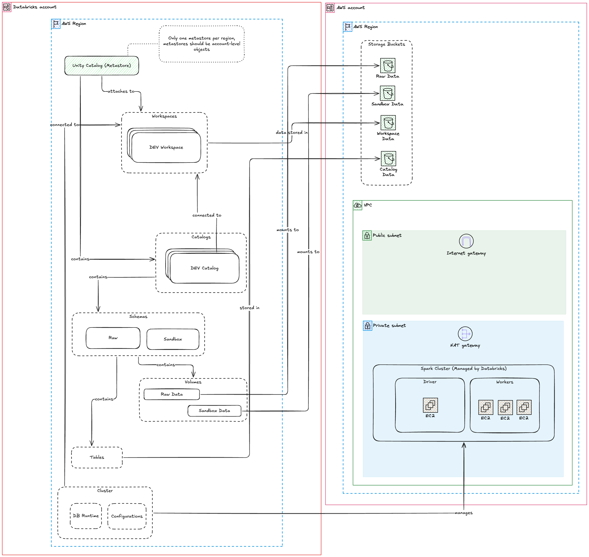

# Databricks Base Infrastructure

This repository contains the modules and deployment configuration to deploy
a Databricks workspace inside using an AWS data plane.

This is meant to be used as a training resource or as a stanrting point for
a  databricks / AWS deployment

The control plane is hosted by databricks

## Design

This repository assumes the AWS accounts are structured in an "umbrella"
format, meaning there's one administrator account, and `N` project accounts
where users are created (either through IAM or IAM Identity Center SSO).

This account structure could look something like this

```
__
  |-->qubika-admin-account (Administrator)
  |
  |-->qubika-project (Folder)
        |
        |-->qubika-project-dev (Development)
        |
        |-->qubika-project-qa (QA)
        |
        |-->qubika-project-prod (Production)
```


This repository assumes a few resources for the "umbrella" AWS account already exist:
* `TerraformAdmin`: a user in the "umbrella" account
* `TerraformAdminRole`: a role in the "umbrella" account
* `TerraformChildRole`: a role existing in each of the child accounts

The child roles should have an assume role policy allowing the admin role to
assume them, and these child roles should have administrator permissions in
their respective accounts.

The admin role should have an assume role policy allowing the admin user to
assume the role.

Additionally, the administrator role should have full s3 access to the
terraform state buckets in the "umbrella" account, where the state backend will
be stored. This ensures that terraform can manage the state files successfully.

Terragrunt will use the admin user credentials to assume the admin role, and
then assume the child roles according to the environment.

`TerraformAdmin (user) => TerraformAdminRole (role) => TerraformChildRole (role)`

## Installation

* Install `opentofu` (OSS version of terraform)
* Install `terragrunt`
* Configure the project according to the instructions bellow
* Run `terragrunt run-all init -reconfigure`

## Configuration

The [root config file](./terragrunt.hcl) for Terragrunt contains variables
pointing to the aws admin account and databricks account. These should be
replaced with the proper accounts.
* `aws_admin_account_id`
* `databricks_account_id`

Some credentials should be provided through environment variables, so they're
not commited to the repository. The `./envrc.template` contains all variables
that should be available in the environment to make authentication to the
providers possible.


## Resources deployed

* **base**
  * **AWS Base**
    * VPC: customer managed vpc to host the ec2 instances
    * Root Bucket: bucket for data storage from all clusters
    * Log Bucket: bucket for log delivery from Databricks
      * audit logs
      * billing logs
    * Cross account role: role used by databricks to access and create ec2 instances in the aws account
  * **Databricks Base**
    * Groups: user groups to access the workspace
      * will create DE and ADMIN groups, then you can control the allocation of users
    * Storage, Network, Credentials configurations: register configurations for the workspace
    * Workspace: will create a new databricks workspace
* **single-node-cluster**: creates a new single node cluster to be used on jobs and all-purpose-compute
* **lakehouse**: creates new sample jobs and repositories to test out with the new single node cluster
* **metastore**: creates a metastore for the catalogs in databricks. Metastores should not be backed by external storage, since they are environment independent
* **catalog**: creates a catalog for the environment. Catalogs act as a database, and will be backed by environment specific storage
  * Schemas: will create `sandbox` and `raw` schemas, with attached volumes pointing to s3 buckets where raw data should be dropped for ingestion
  * Managed storage: will create a managed storage bucket to store the catalog managed tables

## Notes

* Data Governance: this project uses the Databricks Unity Catalog for centralized data governance. All data assets will be registered and controlled through the catalog, and no user should have access to the underlying storage (managed or external).

## Architecture Diagram



## TODOs

* [ ] Add instance profiles to cluster module
* [ ] Add creation of instance pools
* [ ] Move groups creation outside of dev environment
